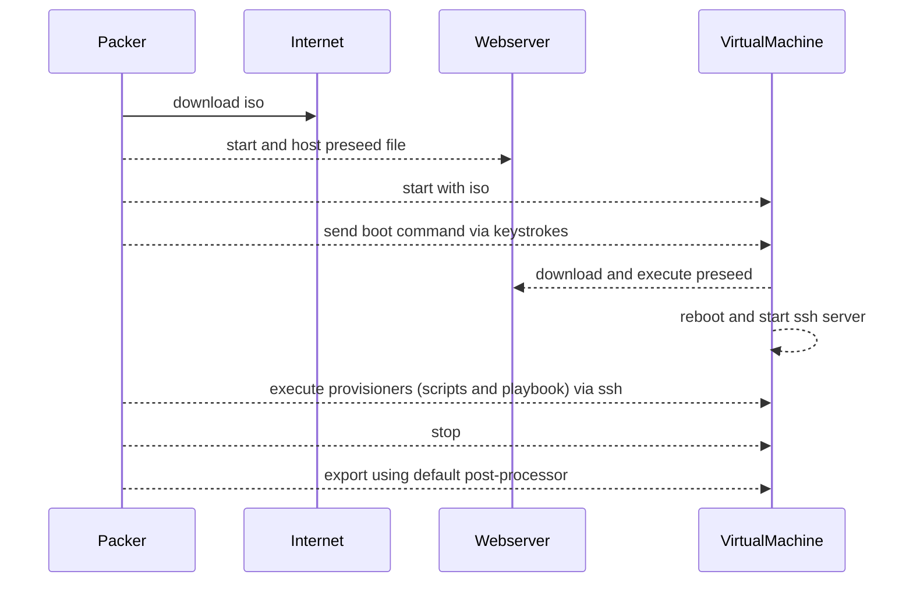

# Packer templates for Mint Cinnamon


## Building with Packer

Requirements:
- Packer: `sudo apt-get install packer`
- VirtualBox: <https://www.virtualbox.org/wiki/Downloads>

Building:  
`packer build core_template.json`

Expected results:
```text
output-virtualbox-iso
├── mint-cinnamon-22.ovf
└── mint-cinnamon-22-disk001.vmdk
```

## How it works, an overview




## Acknowledgments

Special thanks for the work in providing the code on which this is based on to. Have a look at their version of "packer-linuxmint" too. 
- <https://github.com/rmoesbergen>
- <https://github.com/ajxb>

